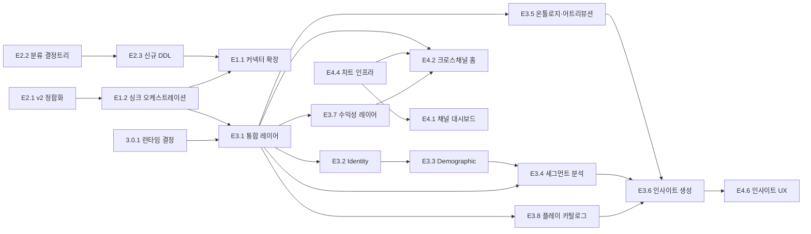

# connext 마스터 태스크 플랜 — 계층적 태스크 분해 (WBS)

**작성:** 2026-07-09 · **성격:** living document — 상태 마커를 직접 갱신하며 사용
**갱신:** 2026-07-09 v1.1 — 기능 확장 검토 반영: 수익성 레이어(E3.7)·자체 수집(E1.5)·웹훅/외부변수(1.2.8~9)·리뷰 원천(1.1.13~14)·데모 모드(4.6.4) 추가, M2.5 신설. 보류 항목은 §6 참조
**갱신:** 2026-07-09 v1.2 — 확장 사고 반영: **데이터 연결 플레이 카탈로그(E3.8, 22개 플레이)** + 근본원인 자동 분해·전후 비교 실험(3.6.6~7) + "왜?" 드릴 UX(4.6.5) + 연결 매트릭스 상설 리뷰(§5 규칙 7)
**현황 근거:** 리포 전수 스캔 (2026-07-09) + `.superpowers/sdd/progress.md` (Phase 1 12/12 완료)

> **이 문서의 역할:** 제품 전체를 4대 핵심 기능(필러) 기준으로 에픽 → 태스크까지 계층 분해한 최상위 플랜.
> 개별 태스크에 착수할 때는 이 문서에서 태스크를 골라 `superpowers:writing-plans` 스킬로
> 실행용 구현 플랜(`docs/superpowers/plans/YYYY-MM-DD-*.md`)을 새로 만든다. 이 문서 자체는 코드 레벨로 내려가지 않는다.

**참조 문서**
- 시스템 설계: [`docs/specs/2026-06-22-unified-data-platform-design.md`](../specs/2026-06-22-unified-data-platform-design.md) (아키텍처 유효 · §7 로드맵은 본 문서로 대체)
- 웨어하우스 스키마 v2 (권위): [`docs/specs/2026-07-05-warehouse-schema-v2.sql`](../specs/2026-07-05-warehouse-schema-v2.sql)
- 디자인: `docs/specs/2026-06-23-connext-design-system.md` — ⚠️ **2026-07-03 Hume 피벗으로 일부 대체됨** (→ 태스크 0.4.1)
- 플랫폼 API 레퍼런스: 리포 루트 `meta.md` `shopify.md` `cafe24.md` 등 12종 + `setup-tutorial-*.md`
- Meta API 테스트 수칙(필독): `CLAUDE.md`

**상태 범례** ✅ 완료 · 🔶 부분 완료 · ⬜ 미착수 · 🧭 결정 필요
**우선순위** P0 = 현재 병목/전제 · P1 = 다음 단계 · P2 = 이후

---

## 0. 제품 정의 (플랜의 기준점)

connext는 한국 D2C 브랜드 운영·마케팅 팀(비개발자)을 위한 **멀티테넌트 크로스플랫폼 데이터 통합·분석 SaaS**.
매출 트래커가 아니라 **5개 통합 도메인** — 커머스 · 광고 · 오디언스 · 콘텐츠 · 전환 — 을 하나의 흐름으로 잇는 **인사이트 엔진**이다.

엔진은 3레이어로 쌓는다 (필러 3의 골격):

1. **Unification** — 채널별 원천 데이터를 도메인별로 정규화·통합
2. **Ontology** — 통합 엔티티(고객·캠페인·콘텐츠·상품·주문)를 의미 그래프로 연결
3. **Data Science** — 상관·어트리뷰션·예측·이상탐지 → 평이한 한국어 인사이트 카드로 노출

**스택:** Next.js 16(App Router) + Supabase(Auth·테넌트·자격증명) + ClickHouse(웨어하우스) + Python `pipeline/`(분석·스크레이핑, `data-pipeline` 브랜치) · Vercel 배포 · pnpm · Node ≥20

---

## 1. 현황 스냅샷 (2026-07-09)

Phase 1(기반 + Shopify/Meta)은 완료. 지금 제품은 "**수동 버튼을 누르면 Shopify 데이터가 들어와서 Shopify 대시보드가 보이는**" 상태다. 자동화·확장·분석 레이어가 이 플랜의 본론.

| 영역 | 상태 | 요약 |
|---|---|---|
| 기반 인프라 (auth·RLS·CH 클라이언트·커넥터 레지스트리·수동 싱크) | ✅ | Phase 1 완료, 라이브 배포 (`connext-snowy.vercel.app`) |
| 커넥터 — Shopify | ✅ | OAuth + 만료형 토큰 로테이션 + fetch 6종, 실데이터 가동 |
| 커넥터 — Meta Ads | ✅ | OAuth(`ads_read`) + campaigns/insights_stat 가동. 토큰 자동 갱신은 없음 |
| 커넥터 — Instagram | 🔶 | OAuth 완료, **TS fetch는 스텁**. Python `pipeline/`에 Graph 클라이언트·스크레이퍼 완성 |
| 커넥터 — GA4·Google Ads·YouTube·TikTok·Cafe24 | 🔶 | OAuth 라우트만 스캐폴드, fetch 커넥터 없음 |
| 커넥터 — Coupang·Naver Search Ad·Naver Commerce·Kakao | ⬜ | 키 입력 라우트 골격 수준 |
| 싱크 파이프라인 | 🔶 | 수동 트리거 + 비동기 처리 + 페이지네이션 루프까지. **스케줄링·증분 워터마크·백필·재시도·레이트리밋 백오프 전부 없음** (7일 고정 윈도우) |
| 웨어하우스 스키마 | ✅ | v2 DDL(snapshot/`_history`/`_stat` 체계) 확정, Shopify·Meta·IG 테이블 가동. 라이브 드리프트 0 확인·`pnpm check:drift` 상설화, ddl.sql은 v2 포인터로 정리 (E2.1 완료 2026-07-10) |
| 애널리틱스/DS | ⬜ | 대시보드 내 Shopify 단일 채널 집계 쿼리만 존재. 크로스채널·identity·demographic·파생 테이블 없음 |
| 대시보드 UI | 🔶 | Shopify 홈 + Meta/IG 채널 대시보드 + 원본 데이터 뷰어 라이브. 인터랙티브 차트 키트(`components/charts/` — 툴팁·토글·모션) 적용 완료(4.4.1). 크로스채널 홈·전역 필터는 미착수 |
| 디자인 | 🔶 | Hume 피벗(라이트 위주·라벤더·Manrope/Pretendard/Spline Sans Mono) 토큰·랜딩 적용. 대시보드 내부는 pill/여백 리파인 미완 |

**알려진 불일치 (문서 ↔ 코드):**
- 디자인 스펙 문서(6-23)는 데이터터미널 시대 기준 → 현재 코드(Hume)가 정답. **스펙을 코드에 맞춰 갱신할 것, 그 반대가 아님** (0.4.1)
- 설계 스펙 §7 로드맵은 필러 3(DS)이 없던 시점의 것 → 본 문서가 대체

---

## 2. 계층적 태스크 분해

### 필러 1 — 플랫폼 연결 & 데이터 싱킹 파이프라인

> 각기 다른 플랫폼을 연결하고, 사람 손 없이 데이터가 계속 흘러들어오게 만든다.

#### E1.1 커넥터 커버리지 확장 — 규모 L

플랫폼별 "연결(자격증명) → fetch 커넥터 → 웨어하우스 적재" 3박자를 완성한다.
접근 모델 3종(위임 OAuth / 키 공유 / 파트너 승인)은 README 분류를 따른다.

| ID | 플랫폼 | 자격증명 | fetch 커넥터 | DDL(v2) | 상태 → 다음 액션 | 우선 |
|---|---|---|---|---|---|---|
| 1.1.1 | Shopify | ✅ | ✅ | ✅ | ✅ 완료 — 유지보수만 | — |
| 1.1.2 | Meta Ads | ✅ | ✅ | ✅ | ✅ 완료 (토큰 갱신은 1.3.1) | — |
| 1.1.3 | Instagram organic | ✅ | ⬜ 스텁 | ✅ | **TS fetch 구현** — Python `pipeline/connext_pipeline/`의 검증된 호출 패턴 포팅 (media, account insights). `CLAUDE.md` 레이트리밋 수칙 준수 | P0 |
| 1.1.4 | GA4 | 🔶 OAuth만 | ⬜ | ✅ (`ga4_daily_stat`) | Data API `runReport` 커넥터 + 토큰버킷(200k/day) | P1 |
| 1.1.5 | Cafe24 | 🔶 OAuth만 | ⬜ | ✅ (4종) | 커넥터 구현 (orders/items/products/customers), KST→UTC, 2 req/s 준수 | P1 |
| 1.1.6 | Google Ads | 🔶 OAuth만 | ⬜ | ⬜ | GAQL 커넥터 + DDL. 개발자 토큰 Basic access 신청 선행 | P2 |
| 1.1.7 | YouTube | 🔶 OAuth만 | ⬜ | ⬜ | Analytics v2 커넥터 + DDL (10k units/day 쿼터) | P2 |
| 1.1.8 | TikTok Ads | 🔶 OAuth만 | ⬜ | ⬜ | Marketing API 커넥터 + DDL | P2 |
| 1.1.9 | Naver Commerce | ⬜ | ⬜ | ⬜ | client_credentials+bcrypt 서명 자격증명 → 커넥터 + DDL (2 RPS) | P2 |
| 1.1.10 | Coupang | ⬜ 폼만 | ⬜ | ⬜ | HMAC 서명 클라이언트 → 커넥터 + DDL | P2 |
| 1.1.11 | Naver Search Ad | ⬜ 폼만 | ⬜ | ⬜ | HMAC 클라이언트 → 커넥터 + DDL | P2 |
| 1.1.12 | Kakao Moment | ⬜ | ⬜ | ⬜ | 파트너 사전 승인 필요 — 승인 신청만 먼저 걸어두기 | P2 |
| 1.1.13 | 채널톡 (CS) | ⬜ | ⬜ | ⬜ | Open API로 상담·고객 문의 수집 → 리뷰·CS 텍스트 마이닝(3.6.5) 원천 | P2 |
| 1.1.14 | 리뷰·댓글 수집 (원천 분리) | — | ⬜ | ⬜ | **IG 댓글**(Graph API, `instagram_manage_comments`, 커넥터 재사용 — 최단) + **Shopify 리뷰**(네이티브 폐지 → Judge.me 등 리뷰앱 API) + Cafe24·네이버·쿠팡 상품 리뷰. **TikTok 조직 댓글은 플랫폼 게이트로 보류**. 전부 3.6.5 텍스트 마이닝 원천. 조사: 루트 `comments-reviews.md` (2026-07-13). DDL은 2.3.3 | P1 |
| 1.1.15 | Shopify POS (오프라인 매장) | ✅ (동일 토큰) | ⬜ | 🔶 | **별도 API 없음** — POS 판매 = 일반 주문(`source_name: pos`). 커넥터에 `source_name`+`retail_location_id` 매핑(+기존 행은 `raw`에서 백필), `locations` data_type, 온·오프 분리 대시보드. 스태프·금전등록기(CashTrackingSession, POS Pro)는 P2. 조사 문서: 루트 `shopify-pos.md` (2026-07-11) | P1 |
| 1.1.16 | 오프라인 POS — 매장 위임 직결 (글로벌) | ⬜ | ⬜ | ⬜ | **모델: 매장이 읽기 권한 위임**(구매 아님) — POS사별 개발자/파트너 등록 + 매장 앱 설치. **실행 순서:** ① 대상 매장 POS 분포 조사 → ② Toast 파트너·Shopify `read_all_orders` 심사 **즉시 신청**(리드타임) → ③ **Square로 PoC**(승인 불필요, OAuth→Orders→SKU 최단) → ④ 어댑터 패턴 확장. **한국: 토스플레이스**(개발자센터 API 키페어·웹훅·서버투서버 실재 확인, 단 멀티머천트 위임 미확정) 우선, 전통 POS(OK/NICE/KIS)는 표준 API 없음 → 별도 트랙(B2B 계약/datapuree). 정규화는 이중정규화 금지 — 벤더 raw `<vendor>_*` 적재 + `unified_orders`(3.1.1) 뷰에서 통합·온오프 split. 조사: 루트 `pos-platforms.md` (2026-07-13 종합) | P2 |

**완료 기준(에픽):** 각 플랫폼이 연결 마법사에서 연결 → 첫 싱크 → `/data` 뷰어에서 행 확인까지 무인으로 통과. 신규 커넥터마다 vitest 단위 테스트 + loop test.

#### E1.2 싱크 오케스트레이션 — 규모 L · **현재 최대 병목**

| ID | 태스크 | 내용 / 완료 기준 | 우선 | 의존 |
|---|---|---|---|---|
| 1.2.1 | 🧭 스케줄러 기술 결정 | Vercel Cron(+Queues) vs **Workflow DevKit**(`"use workflow"` — 재시도·중단복구·sleep 내장, 장시간 싱크에 적합) vs BullMQ. 결정 기록은 ADR로 | P0 | — |
| 1.2.2 | ⬜ 스케줄드 싱크 | 테넌트×커넥션별 주기 실행(기본 일 1회, 채널별 오버라이드). 실패해도 다음 주기 자동 재개 | P0 | 1.2.1 |
| 1.2.3 | ⬜ 증분 워터마크 | 7일 고정 윈도우 제거. v2 규칙 구현: snapshot/history → `updated_at` 워터마크, `_stat` → 최근 N일 재적재(Meta ~4d, GA4 ~2d 재산정 윈도우). `sync_state` 테이블(커넥션×data_type별 최종 워터마크) 신설 | P0 | — |
| 1.2.4 | ⬜ 히스토리 백필 | 신규 연결 시 과거 데이터 소급 적재(기간 선택, 기본 12개월). 청크 분할 + 이어받기(커서 저장). 레이트리밋 안에서 야간 실행 | P1 | 1.2.3 |
| 1.2.5 | ⬜ 재시도 & 에러 분류 | 일시 오류(429/5xx) 지수 백오프 재시도 ↔ 영구 오류(4xx·권한) 즉시 실패 구분. Meta `code 200/access_denied`는 **재시도 금지**(CLAUDE.md) — 연결을 error 상태로 전환하고 사용자 알림 | P0 | 1.2.1 |
| 1.2.6 | ⬜ 레이트리밋 레인 | 플랫폼별 스로틀(응답 헤더 파싱: `X-Business-Use-Case-Usage`, Shopify call-limit 등). 한국 채널(2 RPS) 전용 저속 레인 분리 | P1 | 1.2.2 |
| 1.2.7 | ⬜ 스냅샷 정기 적재 잡 | "스냅샷만 주는 지표"의 시계열화 — IG 계정 인사이트 일일 적재(`instagram_account_insights_stat`), 재고 `shopify_inventory_levels_stat`(품절 기회손실 P-04), 상품 가격 일일 `_stat`(가격 탄력성 P-19) | P1 | 1.2.2 |
| 1.2.8 | ⬜ 웹훅 수신 (준실시간) | Shopify `orders/create` 등 웹훅 엔드포인트 + HMAC 상수시간 검증 + delivery-id 중복 제거 → `orders_history` 즉시 반영. '오늘 실시간' 위젯(4.2.3)의 원천 | P1 | 1.2.3 |
| 1.2.9 | ⬜ 외부 컨텍스트 적재 잡 | 공휴일·날씨·환율 공공 API 일일 적재 (글로벌 참조 데이터 — 테넌트 무관, 규약은 2.2.2) → 상관·예측(3.6)의 설명 변수 | P2 | 1.2.2 |

**완료 기준(에픽):** 일주일간 사람이 아무것도 안 눌러도 모든 활성 커넥션 데이터가 최신으로 유지되고, 실패는 자동 복구되거나 사용자에게 보인다.

#### E1.3 토큰 수명주기 & 연결 신뢰성 — 규모 M

| ID | 태스크 | 내용 | 우선 |
|---|---|---|---|
| 1.3.1 | ⬜ Meta/IG 장기 토큰 갱신 | 60일 장기 토큰 만료 전 자동 교환. 만료 임박 알림 | P1 |
| 1.3.2 | ⬜ 연결 건강 상태 | 커넥션별 상태 머신(active/error/reauth_needed/paused) + 채널 페이지 노출 + 재연결 유도 UX | P1 |
| 1.3.3 | 🧭 자격증명 암호화 | 현재 평문(+RLS·service-role 차단). Supabase Vault 또는 앱 레벨 암호화 도입 여부 결정 | P2 |

#### E1.4 싱크 관측성 — 규모 S

| ID | 태스크 | 내용 | 우선 |
|---|---|---|---|
| 1.4.1 | ⬜ 싱크 이력 UI | `sync_jobs` 기반: 커넥션별 최근 실행, 적재 행 수, 실패 사유(평이한 한국어) | P1 |
| 1.4.2 | ⬜ 운영자 알림 | 연속 실패·토큰 만료 임박 시 알림(이메일 or Slack webhook) | P2 |

#### E1.5 자체 수집 — 제로파티 & 벤치마크 — 규모 M · v1.1 추가

외부 플랫폼 "연결"이 아니라 connext가 **직접 데이터를 만들거나 모으는** 원천.

| ID | 태스크 | 내용 | 우선 | 의존 |
|---|---|---|---|---|
| 1.5.1 | ⬜ 구매 후 설문 (제로파티) | 주문 완료 접점에 1문항 설문("어디서 보고 오셨어요?" + 선택 demographic). v1은 링크 설문으로 시작 가능. `connext_survey_responses_history` 적재 → 어트리뷰션 보정(3.5.2) + demographic **실측**(3.3.3에서 유추보다 우선 사용) | P1 | 2.3.3 |
| 1.5.2 | ⬜ 경쟁 IG 벤치마크 | Python `pipeline/` 스크레이퍼로 경쟁 계정 공개 지표 트래킹 → 비교 뷰. **착수 전 ToS·법무 리스크 검토 게이트 필수** | P2 | 0.1.1 |

---

### 필러 2 — 플랫폼별 데이터 특성 기반 웨어하우스 모델링

> 플랫폼이 주는 데이터의 **시간 의미**를 이해하고 그에 맞는 테이블로 담는다. 네이밍이 곧 설계다:
> `<source>_<entity>`(현재 상태 스냅샷) · `_history`(이벤트 누적) · `_stat`(벤더 일별 집계). `fact_/dim_` 금지.

#### E2.1 v2 스키마 정합화 — 규모 S

| ID | 태스크 | 내용 | 우선 |
|---|---|---|---|
| 2.1.1 | ✅ v1 잔재 제거 | `lib/clickhouse/ddl.sql`을 v2 포인터로 축소, 커넥터 `targetTable()` 매핑은 v2 계약 테스트(`tests/lib/clickhouse/v2-schema-contract.test.ts`)로 영구 검증. `/data` 뷰어의 v1 테이블명 잔재도 함께 제거 (2026-07-10 완료, 플랜: `docs/superpowers/plans/2026-07-10-e21-v2-schema-alignment.md`) | P0 |
| 2.1.2 | ✅ 라이브 CH ↔ v2 드리프트 점검 | 2026-07-10 라이브 대조: 31/31 테이블 드리프트 0(컬럼·타입·파티션/정렬 키), 마이그레이션 불필요. `pnpm check:drift`로 상설화 — 향후 스키마 작업 전후 재검증 | P0 |

#### E2.2 데이터 특성 분류 결정 트리 — 규모 S · **필러 2의 헌법**

신규 데이터 타입마다 아래 결정 트리를 적용하고, 결과를 v2 SQL 헤더 주석에 누적 기록한다 (2.2.1 ⬜ P1: 이 규칙을 `docs/specs/`에 독립 문서로 승격 + 신규 플랫폼 적용 예시 추가):

```
이 데이터는 무엇인가?
├─ 시점 이벤트인가 (주문·환불·거래처럼 발생 사실)?
│    → `_history` — 초 단위 이벤트로 영구 누적. 누적 매출·시계열은 쿼리 시 집계로 파생
│      (예: 플랫폼이 "단일 주문"만 줘도 orders_history에 쌓으면 누적 매출이 나온다)
├─ 벤더가 이미 일별로 집계해 주는 지표인가 (광고 인사이트·GA4 리포트)?
│    → `_stat` — 있는 그대로 저장, 재산정 윈도우만큼 재적재
├─ 현재 값만 제공되는데 추이가 필요한 지표인가 (팔로워 수·재고)?
│    → 우리가 매일 찍어서 `_stat`으로 시계열화 (예: instagram_account_insights_stat)
└─ 현재 상태만 있으면 되는 메타데이터인가 (상품·고객 프로필·캠페인 설정)?
     → 무접미사 snapshot — latest-wins, 히스토리 불필요
       (단, 불변 컬럼은 공짜 시계열: customers.created_at → 신규 고객 수/일)
```

**2.2.2 ⬜ P1 (v1.1 추가) — 결정 트리 분기 신설:** ① **글로벌 참조 데이터**(공휴일·날씨·환율): 테넌트 무관 → `ext_` 접두 + `tenant_id` 규약 예외 명문화. ② **자체 생성 원천**(설문 응답 등): source = `connext` 네임스페이스.

#### E2.3 신규 플랫폼 스키마 확장 — 규모 M

| ID | 태스크 | 내용 | 우선 | 의존 |
|---|---|---|---|---|
| 2.3.1 | ⬜ TikTok·YouTube·Google Ads DDL | 결정 트리 적용해 v2에 추가 (대체로 config snapshot + `_stat`) | P2 | 2.2.1 |
| 2.3.2 | ⬜ Naver·Coupang·NSA·Kakao DDL | 한국 채널 특수성 반영: KST→UTC, 마스킹된 PII(안심번호), 정산(settlement) 이벤트 | P2 | 2.2.1 |
| 2.3.3 | ⬜ 리뷰·설문·외부변수 DDL | 상품 리뷰(`*_product_reviews_history`), 구매 후 설문(`connext_survey_responses_history`), 외부 참조(`ext_*`) — 2.2.2 규약 적용 | P1 | 2.2.2 |

**완료 기준(에픽):** 커넥터가 붙는 시점에 해당 플랫폼 DDL이 이미 v2에 존재 (커넥터 구현이 스키마를 기다리지 않게 함).

#### E2.4 데이터 품질 & 정합성 — 규모 M

| ID | 태스크 | 내용 | 우선 |
|---|---|---|---|
| 2.4.1 | ⬜ 정합성 자동 점검 | 일별 행 수 급변·중복률·워터마크 정체 감지 쿼리 + 대시보드 배지 | P1 |
| 2.4.2 | ⬜ 정규화 규약 집행 | 통화(minor/major)·타임존·test 주문 필터(`test=1` 제외)가 모든 커넥터에서 일관되는지 테스트로 고정 | P1 |
| 2.4.3 | ⬜ 테넌트 삭제(GDPR) | `PARTITION BY tenant_id` 활용한 파티션 드롭 + Supabase cascade 삭제 절차 | P2 |

---

### 필러 3 — 애널리틱스 & DS 파이프라인 (인사이트 엔진)

> 1차 데이터를 잇고(통합), 2차·3차 연결(유추·교차)로 숨은 부가가치를 만든다. 여기가 connext의 차별점.

#### E3.0 실행 환경 결정 — 규모 S

| ID | 태스크 | 내용 | 우선 |
|---|---|---|---|
| 3.0.1 | 🧭 분석 레이어 런타임 | 후보: (a) ClickHouse 뷰/머티리얼라이즈드 뷰 중심 + TS BFF, (b) Python `pipeline/` 배치가 파생 테이블 적재, (c) 혼합(집계=CH, ML/유추=Python). 파생 테이블 네이밍(`derived_*` = source가 connext 자신)도 함께 확정, ADR 기록 | P0 |

#### E3.1 Layer 1 — 크로스플랫폼 통합(Unification) — 규모 L

| ID | 태스크 | 내용 / 완료 기준 | 우선 | 의존 |
|---|---|---|---|---|
| 3.1.1 | ⬜ 도메인 통합 뷰 v1 | `unified_orders`(Shopify+Cafe24…), `unified_ad_daily`(Meta+GA4+…): 채널 컬럼 + 공통 스키마로 정규화. 통화 환산 규칙 포함 | P0 | 3.0.1 |
| 3.1.2 | ⬜ Blended 지표 | 일별 테넌트 단위 ROAS·CAC·AOV = `unified_ad_daily.spend` ↔ `unified_orders.revenue`. **주: Meta `_stat`(conversions·conversion_value)와 `orders_history`가 이미 있어 Shopify×Meta 쌍으로 즉시 착수 가능한 최단 경로** | P0 | 3.1.1 |
| 3.1.3 | ⬜ 동일 지표 채널 비교 | 5도메인 프레임: engagement(IG vs TikTok vs YT), 광고 효율(Meta vs Google) 등 도메인별 비교 쿼리 세트 | P1 | 3.1.1 |

#### E3.2 고객 Identity Resolution — 규모 M

| ID | 태스크 | 내용 | 우선 | 의존 |
|---|---|---|---|---|
| 3.2.1 | ⬜ 매칭 키 정규화 | email lowercase/trim, 전화번호 E.164 정규화 + 해시. 원본 PII 최소화 원칙 | P1 | 3.0.1 |
| 3.2.2 | ⬜ `derived_customer_identity` | 플랫폼 고객 ID ↔ 통합 고객 ID 매핑 테이블(email/phone 결정적 매칭 v1; 확률 매칭은 후순위) | P1 | 3.2.1 |

#### E3.3 Demographic 인리치먼트 (2차 유추) — 규모 M

| ID | 태스크 | 내용 | 우선 | 의존 |
|---|---|---|---|---|
| 3.3.1 | ⬜ 배송 주소 → 지역 | 주소(country/province/city, 한국은 시도·시군구 표준화) → 지역 코드. `derived_customer_geo` | P1 | 3.0.1 |
| 3.3.2 | ⬜ 이름 → 성별 추정 | 한국 이름 기반 성별 확률 추정(확신도 낮으면 unknown). Cafe24는 gender 필드 원천 제공 → 원천 우선 | P2 | 3.2.2 |
| 3.3.3 | ⬜ `derived_customer_profile` | 통합 고객 × {지역, 성별(+확신도), 연령대(가용 시), 첫구매일, 채널} 단일 프로필 테이블 | P1 | 3.3.1 |

#### E3.4 세그먼트 & 행동 분석 (3차 교차) — 규모 L

| ID | 태스크 | 내용 | 우선 | 의존 |
|---|---|---|---|---|
| 3.4.1 | ⬜ RFM & LTV | `orders_history` 기반 R/F/M 스코어, 코호트별 LTV 곡선 (스냅샷 amount_spent이 아닌 이벤트 집계로) | P1 | 3.1.1 |
| 3.4.2 | ⬜ 코호트 리텐션 | 첫구매월 코호트 × 재구매율 매트릭스, 재구매 주기 분포 | P1 | 3.4.1 |
| 3.4.3 | ⬜ demographic × 구매 교차 | 지역·성별·연령대별 매출/AOV/재구매/상품 선호 — "누가 무엇을 사는가" | P1 | 3.3.3, 3.4.1 |
| 3.4.4 | ⬜ 상품 어피니티 | 장바구니 동시구매(line_items 기반) 연관 분석 | P2 | 3.1.1 |

#### E3.5 Layer 2 — 온톨로지 & 어트리뷰션 — 규모 L

| ID | 태스크 | 내용 | 우선 | 의존 |
|---|---|---|---|---|
| 3.5.1 | ⬜ 엔티티 그래프 스키마 | 고객–주문–상품–캠페인–콘텐츠 관계 정의 (조인 키 계약 문서 + 뷰) | P2 | 3.1.1, 3.2.2 |
| 3.5.2 | ⬜ 터치포인트 어트리뷰션 v1 | 이미 적재 중인 원재료 활용: `orders_history.landing_site/referring_site/discount_codes` + `shopify_marketing_events`(UTM) + 광고 `_stat` → 채널별 기여 (라스트터치 v1) | P1 | 3.1.2 |
| 3.5.3 | ⬜ IG 부스트 게시물 연결 | 광고 크리에이티브 `effective_instagram_media_id` ↔ `instagram_media` 조인 — organic↔paid 콘텐츠 연결 (CLAUDE.md 기록 패턴) | P2 | 1.1.3 |

#### E3.6 Layer 3 — 인사이트 생성 — 규모 L

| ID | 태스크 | 내용 | 우선 | 의존 |
|---|---|---|---|---|
| 3.6.1 | ⬜ 상관 분석 배치 | 도메인 간 지표 상관(예: IG engagement ↔ 매출, 광고비 ↔ 신규고객) + 시차(lag) 분석 | P2 | 3.1.3 |
| 3.6.2 | ⬜ 이상 탐지 | 지표 급변 감지(요일 보정) → 마일스톤 피드 이벤트화 | P2 | 3.1.2 |
| 3.6.3 | ⬜ 예측 v1 | 매출·주문 단기 예측 + 신뢰 구간 | P2 | 3.4.1 |
| 3.6.4 | ⬜ 인사이트 카드 파이프라인 | 분석 결과 → **평이한 한국어 문장**("인스타 콘텐츠가 매출을 끌어요") 카드 생성·저장·노출 규약. r값·매트릭스 원값은 절대 마케터에게 노출하지 않음 | P1 | 3.6.1–3.6.3 중 1개 이상 |
| 3.6.5 | ⬜ 리뷰 텍스트 마이닝 (v1.1) | 리뷰·CS 텍스트 LLM 토픽·감성 분석 → `derived_review_signals` → "상품 X 배송 불만 급증" 류 카드 | P2 | 1.1.14, 3.6.4 |
| 3.6.6 | ⬜ 근본원인 자동 분해 (v1.2) | 지표 급변(3.6.2) 감지 시 자동 드릴: 채널×상품×지역×신규/재구매 축으로 기여도 분해 → "매출 -18%는 대부분 메타 트래픽 감소 + 상품 A 품절" 수준까지 카드가 답함 | P1 | 3.6.2 |
| 3.6.7 | ⬜ 전후 비교 실험 프레임 (v1.2) | 가격 변경·프로모션·소재 교체를 이벤트로 기록(`marketing_events`+가격 `_stat` 활용) → 전후 기간 자동 비교(요일·시즌 보정) — 준인과 효과 측정의 표준 절차화 | P2 | 3.6.1 |

#### E3.7 수익성(Profit) 레이어 — 규모 M · v1.1 추가

> "매출"이 아니라 "**남는 돈**"을 보여준다. 결제수수료·환불·정산 데이터는 이미 v2 DDL에 적재 대상으로 있어(`payouts/transactions/refunds_history`) 재료 대부분이 확보된 상태 — COGS 입력만 신규다. (Triple Whale의 초기 성장 wedge와 같은 위치)

| ID | 태스크 | 내용 | 우선 | 의존 |
|---|---|---|---|---|
| 3.7.1 | ⬜ 비용 모델 입력 | 상품별 COGS 입력 UI + CSV 업로드, 배송비 규칙, 기타 고정비 — Supabase 테넌트 설정 테이블 | P1 | — |
| 3.7.2 | ⬜ 공헌이익 파생 | `derived_profit_daily`: 매출(orders) − 광고비(unified_ad_daily) − 결제수수료 − 환불 − 배송 − COGS, 일별 | P1 | 3.1.2, 3.7.1 |
| 3.7.3 | ⬜ "오늘 남은 돈" 패널 | 홈에 일별 공헌이익 카드 + 마진율 추이 + 비용 구성 분해 차트 | P1 | 3.7.2, 4.4.1 |
| 3.7.4 | ⬜ 쿠폰·프로모션 ROI | `discount_codes`·`price_rules` × 주문 조인 — 쿠폰별 매출 기여 vs 할인 비용 vs 마진 영향 | P2 | 3.7.2 |

#### E3.8 데이터 연결 플레이 카탈로그 — 2차·3차 부가가치 · v1.2 추가 · **열린 목록**

> **원리:** "배송주소→demographic, demographic×주문"은 사례일 뿐이다. 일반 원리는 **원천×원천 연결 매트릭스를 체계적으로 스캔해 숨은 부가가치를 캐는 것** — 이 카탈로그가 그 결과물이고, 새 원천이 붙을 때마다 재스캔한다(§5 규칙 7). 각 플레이 = 파생 테이블/뷰 1개 + 인사이트 카드 쿼리 1개(3.6.4 파이프라인으로 노출). v2 스키마에서 조인 키가 실존하는 연결만 등재한다.

**누수 감지 — 돈이 새는 곳**

| ID | 플레이 | 연결 | 가치 | 가능 시점 | 우선 |
|---|---|---|---|---|---|
| P-01 | 순(net) ROAS | `meta_ads_insights_stat.conversion_value` × `refunds/orders_history`(환불·취소) | 광고 플랫폼이 절대 안 보여주는 "환불 반영 진짜 ROAS" | **지금** | P0 |
| P-02 | UTM 누수 감사 | `orders.landing_site/referring_site` × `marketing_events`(UTM) × GA4 source | "주문의 몇 %가 출처 불명인가" — 어트리뷰션 사각지대 정량화 | M3 | P1 |
| P-03 | 광고↔재고 미스매치 | 활성 `meta_ads_ads`×상품 매핑 × `inventory_levels` × 판매속도 | "재고 3일치인데 광고 집행 중" / "재고 과잉인데 광고 0원" | 지금+광고-상품 매핑 | P1 |
| P-04 | 품절 기회손실 | 재고 `_stat`(1.2.7) × 평시 판매속도 | 품절 기간 놓친 매출 금액화 | M1 후 | P1 |
| P-05 | 결제 실패 감시 | `transactions.gateway × status` 추이 | 게이트웨이 장애·실패율 급증 조기 경보 | **지금** | P1 |
| P-06 | 할인 중독 세그먼트 | 고객 × `discount_codes` 사용률 × 마진 | 정가 구매자 vs 쿠폰 대기자 구분 → 마진 보호 | M4(COGS) | P2 |
| P-07 | 차지백 리스크 패턴 | `disputes` × 주문 특성(금액·할인·지역·첫구매) | 리스크 주문 프로파일 → 사전 대응 | M1 후 | P2 |

**타이밍 인텔리전스**

| ID | 플레이 | 연결 | 가치 | 가능 시점 | 우선 |
|---|---|---|---|---|---|
| P-08 | 광고 피로도 감지 | `insights_stat.frequency`↑ × CTR↓ 추세 | "이 소재 교체할 때" 신호 | **지금** | P0 |
| P-09 | 콘텐츠→매출 시차 | `instagram_media` 게시 시점 × GA4 세션 × 주문 스파이크(lag 상관) | "게시물이 매출을 끄는 데 걸리는 시간" — organic의 돈 가치 | M3 | P1 |
| P-10 | 부스트 후보 추천 | organic 성과 상위 media × 과거 부스트 성과(3.5.3 조인) | "다음에 부스트할 게시물" 제안 | M3 | P2 |
| P-11 | 세그먼트 골든아워 | 주문 시간대 × demographic × 채널 | "20대는 밤 11시" — 광고 스케줄·발송 시점 최적화 | M4 | P2 |
| P-12 | 재구매 적기 리스트 | 상품별 재구매 간격 분포 × 고객 최근 구매일 | "다시 살 때가 된 고객" 목록 (보류 중인 B 행동 루프의 1순위 소재) | M4 | P1 |

**고객 깊이**

| ID | 플레이 | 연결 | 가치 | 가능 시점 | 우선 |
|---|---|---|---|---|---|
| P-13 | 신규/기존 분리 ROAS | 광고 전환 × identity(3.2) 신규 여부 | 광고 잠식(cannibalization) 감지 — "어차피 살 사람에게 광고비를 쓰는가" | M4 | P1 |
| P-14 | 획득 채널 코호트 품질 | 첫 주문 출처(UTM/landing) × LTV·반품률 | "메타 고객은 싸지만 반품 많고, 검색 고객은 LTV 2배" | M4 | P1 |
| P-15 | VIP 조기 식별 | 첫 주문 특성(금액·상품·채널·시간대) → LTV 상위 확률 | 첫 구매 직후 차등 대응 근거 | M4 | P2 |
| P-16 | CS→이탈 신호 | 채널톡 문의·응답 시간 × 재구매 변화 | "응답 24h 넘으면 이탈 +X%p" — CS가 매출 지표가 됨 | M5 | P2 |

**상품 지능**

| ID | 플레이 | 연결 | 가치 | 가능 시점 | 우선 |
|---|---|---|---|---|---|
| P-17 | 반품 삼각측량 | `returns` × demographic × 리뷰 토픽(3.6.5) | "이 상품, 20대 반품률 2배 — 원인은 사이즈" | M5 | P1 |
| P-18 | 번들 마진 최적화 | 동시구매(line_items) × COGS 마진 | "같이 팔면 마진 좋은 조합" 번들 제안 | M4 | P2 |
| P-19 | 가격 탄력성 | 가격 일일 `_stat`(1.2.7) × 판매속도 | 가격 변경 실험의 정량 근거 (3.6.7과 연동) | M1 후 | P2 |
| P-20 | 날씨·시즌 민감도 | `ext_*`(1.2.9) × 상품별 판매 | "비 오면 팔리는 상품" — 수요 설명력·예측(3.6.3) 향상 | M5 | P2 |

**운영 연결**

| ID | 플레이 | 연결 | 가치 | 가능 시점 | 우선 |
|---|---|---|---|---|---|
| P-21 | 배송 리드타임 × 재구매 | `fulfillments` 소요일 × 고객 재구매율 | "출고 하루 늦으면 재구매 -X%p" — 물류가 마케팅 지표가 됨 | M1 후 | P1 |
| P-22 | 장바구니 회수 가치 | `abandoned_checkouts` 금액 × 완료 전환율 | "이번 주 ₩X가 결제 직전에 멈췄다" + 회수 여지 정량화 | **지금** | P0 |
| P-23 | 매장↔온라인 고객 교차 | `orders_history.source_name/retail_location_id` × identity(3.2) | 첫 구매가 매장인 고객 vs 온라인 고객의 재구매율·LTV·채널 이동 — 오프라인이 온라인을 키우는지 정량화 | 1.1.15 후 | P2 |

**완료 기준(필러 3):** 비개발자가 대시보드에서 "어느 채널이 매출을 만들고, 실제로 얼마가 남고, 누가 고객이고, 다음에 뭘 해야 하는지"를 문장으로 읽을 수 있다.

---

### 필러 4 — 시각화 대시보드 & UX 최적화

> 데이터를 비개발자에게 직관적이고 흥미로운 인사이트로. 디자인 truth = **Hume 피벗**(라이트 위주 · 라벤더 `#C094E4` 하이라이트 · pill 버튼 · Manrope/Pretendard/Spline Sans Mono). UX 원칙 = Toss 공식(한 화면 한 가지, 쉬운 한국어, OAuth 스코프·API 용어 노출 금지).

#### E4.1 채널별 대시보드 — 규모 M

| ID | 태스크 | 내용 | 우선 | 의존 |
|---|---|---|---|---|
| 4.1.1 | ⬜ Meta Ads 대시보드 | 스캐폴드된 `/dashboard/meta`에 실쿼리: spend·impressions·CTR·CPC 추이, 캠페인 테이블 | P0 | (데이터 있음) |
| 4.1.2 | ⬜ Instagram 대시보드 | 팔로워·도달 추이(`_stat`), 게시물 성과 테이블 | P1 | 1.1.3 |
| 4.1.3 | ⬜ 신규 채널 대시보드 템플릿 | 채널 대시보드 공통 골격 추출 — 커넥터 추가 시 대시보드가 자동으로 최소 뷰 확보 | P1 | 4.1.1 |

#### E4.2 크로스채널 홈 — 규모 M

| ID | 태스크 | 내용 | 우선 | 의존 |
|---|---|---|---|---|
| 4.2.1 | ⬜ 홈 개편: 5도메인 KPI | Shopify 단일 채널 홈 → 커머스·광고·오디언스·콘텐츠·전환 도메인 카드 + blended ROAS/CAC | P1 | 3.1.2 |
| 4.2.2 | ⬜ 채널 시리즈 비교 차트 | 멀티라인/스택 차트(채널 색상 토큰), 레전드 토글 | P1 | 3.1.3, 4.4.1 |
| 4.2.3 | ⬜ '오늘 실시간' 위젯 (v1.1) | 웹훅(1.2.8) 기반 오늘 매출·주문 실시간 카드 — ARIA-live, 일시정지, "Data as of" 규칙 준수 | P1 | 1.2.8 |

#### E4.3 디자인 시스템 마감 — 규모 S

| ID | 태스크 | 내용 | 우선 |
|---|---|---|---|
| 4.3.1 | 🔶 대시보드 Hume 리파인 | dashboard 3탭: 모션 시스템(스태거 진입·드로우인·카운트업·마이크로 인터랙션)·스켈레톤 로딩·focus-visible·`--ch-instagram` 토큰 적용, 라이트/다크/모바일 브라우저 검증 완료 (2026-07-10). **남음:** channels·connect-wizard 화면 리파인 | P1 |
| 4.3.2 | ⬜ 접근성 패스 | 색상 단독 상태표시 금지(아이콘+라벨), ARIA-live(실시간 값), 키보드 조작, WCAG AA | P1 |

#### E4.4 차트 & 조작성 인프라 — 규모 M

| ID | 태스크 | 내용 | 우선 |
|---|---|---|---|
| 4.4.1 | ✅ 차트 레이어 결정·구축 | **결정: 커스텀 SVG** (의존성 0, Hume 마크 스펙 소유, ADR은 `docs/superpowers/plans/2026-07-10-chart-kit-and-motion.md`). `components/charts/` 키트 구축: TimeSeriesChart(크로스헤어 툴팁·레전드 토글·원축 원칙), TrendExplorer(메트릭 스위처), HourBars, AnimatedNumber + 모션 시스템(globals.css, reduced-motion 대응) + 스케일 수학 vitest. 대시보드 3종 적용, 팔레트는 dataviz 검증기 통과(다크 `--ch-*` 스냅). (2026-07-10 완료) | P0 |
| 4.4.2 | ⬜ 전역 필터 | 기간 선택(프리셋+커스텀) + 채널 필터 — 모든 패널 공통 상태 | P1 |
| 4.4.3 | ⬜ 크로스필터 & 드릴다운 | 레전드/세그먼트 클릭 → 연동 필터링, 드릴 경로 브레드크럼 | P2 |
| 4.4.4 | ⬜ CSV 내보내기 | 테이블·차트 데이터 다운로드 | P2 |

#### E4.5 고급 시각화 (DS 연동) — 규모 M

| ID | 태스크 | 내용 | 우선 | 의존 |
|---|---|---|---|---|
| 4.5.1 | ⬜ 상관 히트맵 + 산점도 | 3.6.1 결과 뷰 (내부/파워유저용 화면, 기본 노출은 카드) | P2 | 3.6.1 |
| 4.5.2 | ⬜ 어트리뷰션 Sankey | 채널→매출 흐름 | P2 | 3.5.2 |
| 4.5.3 | ⬜ 예측 밴드 차트 | 실측+예측+신뢰구간 | P2 | 3.6.3 |

#### E4.6 인사이트 UX — 규모 M

| ID | 태스크 | 내용 | 우선 | 의존 |
|---|---|---|---|---|
| 4.6.1 | ⬜ 인사이트 카드 UI | 3.6.4 카드의 노출 위치·우선순위·해석 도움말. 흥미 유발 요소(추이 미니차트 내장) | P1 | 3.6.4 |
| 4.6.2 | ⬜ 마일스톤 피드 | "이번 주 하이라이트" 이벤트 피드(대시보드와 별개 존재 — 확정된 UX 결정) | P2 | 3.6.2 |
| 4.6.3 | ⬜ 온보딩·빈 상태 | 데이터 없음/싱크 중/오류 상태 화면을 Toss 공식으로(스켈레톤, 쉬운 문구, 다음 행동 1개) | P1 | — |
| 4.6.4 | ✅ 데모 모드 (v1.1) | 공개 `/demo` 6탭(질문 중심: Overview·Moments·Sales·Marketing·Audience·Retention). 피크 이벤트 감지(무슨 일이 있었나 마커), 제품/채널/신규·기존/지역 revenue lens(다각도 stacked), 인플루언서·레퍼럴·프로모션, 팔로워 성장, 고객·채널 demographics — 시드 PRNG 90일 상관관계 내장 샘플(가상 뷰티 브랜드 Glowlab, USD·영어 카피 — 2026-07-11 영어 전환), 인사이트 카드, 히트맵·코호트·StackBar 신규 차트, 랜딩 CTA 연결, 전 뷰 샘플 배지+연결 CTA (2026-07-11 완료, 플랜: `docs/superpowers/plans/2026-07-11-demo-mode.md`) | P1 | — |
| 4.6.5 | ⬜ "왜?" 드릴 (v1.2) | 모든 인사이트 카드·이상 알림에 "왜?" 버튼 → 근본원인 분해(3.6.6) 결과와 근거 데이터를 한 화면에. 카드의 신뢰는 근거 접근성에서 나온다 | P1 | 3.6.6 |

---

### 필러 0 (횡단) — 운영 기반

| ID | 태스크 | 내용 | 우선 |
|---|---|---|---|
| 0.1.1 | 🔶 브랜치 정리 | `data-pipeline`(Python) ↔ `main`(웹) 장기 분리 여부 결정 — 3.0.1과 함께. 웹 변경이 data-pipeline에 고여 있으면 main에 머지 | P1 |
| 0.2.1 | ⬜ 배포 파이프라인 복구 | git auto-deploy 고장 → 현재 `vercel --prod --yes` 수동. 원인 조사 or CLI 배포를 공식 절차로 문서화 | P2 |
| 0.3.1 | 상시 | **품질 게이트: 모든 기능 구현 후 loop test(품질·슬롭 점검)** — 설계 스펙 §8, 필수 | P0 |
| 0.4.1 | ⬜ 문서 정합화 | 디자인 스펙을 Hume 기준으로 갱신(코드가 truth), v1 DDL 정리(2.1.1과 함께), 설계 스펙 §7에 본 문서 링크 | P1 |

---

## 3. 마일스톤 — 세로 절단 (권장 실행 순서)

각 마일스톤은 "사용자가 체감하는 가치" 단위다. 에픽을 통째로 끝내지 말고 마일스톤 단위로 필러를 가로질러 진행한다.

| 마일스톤 | 가치 문장 | 포함 태스크 | 종료 조건 |
|---|---|---|---|
| **M1 — 손 안 대도 도는 데이터** | "연결해두면 매일 아침 최신이다" | 1.2.1→1.2.2, 1.2.3, 1.2.5, 2.1.1, 2.1.2, 1.4.1 | 7일 무인 운영 성공 |
| **M2 — 광고↔매출 첫 연결** | "광고비가 매출로 돌아오는지 보인다" | 3.0.1, 3.1.1, 3.1.2, 4.1.1, 4.4.1 | Shopify×Meta blended ROAS가 홈에 표시 |
| **M2.5 — 남는 돈이 보인다** (v1.1) | "오늘 장사, 실제로 얼마 남았는지 안다" | 3.7.1, 3.7.2, 3.7.3, 1.2.8, 4.2.3 | 일별 공헌이익 카드 + 실시간 오늘 위젯 라이브 |
| **M3 — 채널 확장 1차** | "IG·GA4·Cafe24까지 한 화면" | 1.1.3, 1.1.4, 1.1.5(리뷰 1.1.14 포함), 1.2.6, 1.2.7, 1.3.1, 4.1.2, 4.1.3, 4.2.1, 4.2.2, 4.6.4(데모) | 5개 채널 데이터가 크로스채널 홈에 |
| **M4 — 고객을 아는 대시보드** | "누가 사는지, 다시 사는지 안다" | 3.2.1, 3.2.2, 3.3.1, 3.3.3, 3.4.1, 3.4.2, 3.4.3, 1.2.4(백필), 1.5.1(설문) | demographic×구매 교차 뷰 라이브 |
| **M5 — 인사이트 엔진 v1** | "대시보드가 다음 행동을 말해준다" | 3.5.2, 3.6.1, 3.6.2, 3.6.4, 3.6.5, 1.2.9, 4.6.1, 4.6.3 | 주 1개 이상 유의미한 한국어 인사이트 카드 자동 생성 |
| **M6+ — 확장** | 한국 채널 전면화·온톨로지·예측 | 1.1.6–1.1.13, 1.5.2, 2.3.x, 3.5.1, 3.6.3, 3.7.4, 4.5.x, 4.6.2 | 별도 재계획 |

병행 규칙: M1(파이프라인)과 M2(분석 최단 경로)는 의존이 얕아 **동시 진행 가능**. M2.5는 M2 직후 최우선 — 재료가 이미 적재 대상이라 짧다. M4는 M3의 Cafe24/IG 데이터가 있을수록 정확해지지만 Shopify 단독으로도 시작 가능.

플레이 편입 규칙(v1.2): 마일스톤마다 **E3.8 카탈로그에서 그 시점 가용 데이터로 가능한 플레이를 2~3개씩 뽑아 함께 출시**한다. quick-win 3종(P-01 순ROAS · P-08 광고 피로도 · P-22 장바구니 회수 가치)은 현재 데이터로 즉시 가능 — M2.5에 편입.

---

## 4. 에픽 의존성 지도



---

## 5. 실행 규칙

1. **태스크 착수 절차:** 이 문서에서 태스크 선택 → `superpowers:writing-plans`로 구현 플랜 작성(`docs/superpowers/plans/`) → 구현 → **loop test** → 이 문서 상태 마커 갱신.
2. **Meta/IG API 작업 시** `CLAUDE.md` 수칙 필수(버스트 금지, `X-Business-Use-Case-Usage` 확인, `access_denied` 재시도 금지).
3. **스키마 변경은 반드시 E2.2 결정 트리 통과** 후 v2 SQL에 반영 (개별 ddl 파일 신설 금지).
4. **디자인 작업은** `anti-ai-slop-design` + `data-dashboard-design` 스킬 적용, Hume 토큰(`app/globals.css`)이 유일한 truth.
5. **배포:** `vercel --prod --yes` (git auto-deploy 고장 상태), Node ≥20, pnpm only.
6. **UX 카피:** 쉬운 한국어. OAuth 스코프명·API 용어를 사용자에게 노출하지 않는다.
7. **연결 매트릭스 상설 리뷰(v1.2):** 새 데이터 원천이 붙을 때마다(커넥터 1개 완성 = 트리거) 기존 전 원천과의 교차를 스캔해 E3.8 카탈로그에 신규 플레이를 추가한다. 카탈로그는 닫힌 목록이 아니다 — "이 데이터로 또 뭘 알 수 있지?"가 표준 질문.

## 6. 리스크 & 열린 결정

| 항목 | 내용 | 관련 |
|---|---|---|
| 🧭 스케줄러 선택 | Vercel Cron+Queues vs Workflow DevKit vs BullMQ — 장시간 백필·재시도 요건이 결정 기준 | 1.2.1 |
| 🧭 분석 런타임 | CH 뷰 vs Python 배치 vs 혼합 + `derived_*` 네이밍 확정 | 3.0.1 |
| 🧭 자격증명 암호화 | Vault 도입 시점 | 1.3.3 |
| ⚠️ 외부 승인 리드타임 | Shopify Protected Customer Data 승인, Google Ads Basic access, Kakao 파트너 승인 — **먼저 신청 걸어두고 개발은 병행** | 1.1.x |
| ⚠️ Meta 개발모드 리밋 | 라이브 테스트 버스트 시 앱 전체 차단 이력 — 테스트는 pytest 우선 | 전역 |
| ⚠️ 한국 채널 PII 마스킹 | 안심번호·이메일 제거 → identity 매칭 정확도 하락 가능, E3.2 설계 시 반영 | 3.2.x |
| ⚠️ 스크레이핑 ToS | 경쟁 벤치마크(1.5.2)는 착수 전 법무 검토 게이트 필수 | 1.5.2 |

**보류 항목 (2026-07-09 기능 확장 검토에서 채택하지 않음 — 재검토 트리거 명시):**

- **B 행동 루프** (룰 알림·주간 AI 리포트·세그먼트 push/reverse ETL) — **M5 인사이트 카드 가동 후** 재검토. 알림·리포트는 카드의 "배달 채널"이라 그때가 적기. 국내 시장(데이터라이즈)이 검증한 방향
- **C AI 인터페이스** (자연어 질의 "Ask connext"·크리에이티브 vision 분석) — **unified 레이어(3.1) 안정화 후** 재검토. 글로벌 시장 표준화 진행 중(Ask Polar, Triple Whale Moby — MCP 노출 포함)
- **E2 팀·공유 링크 / E3 빌링** — **M6 재계획 시점**(상용화 트랙)에
